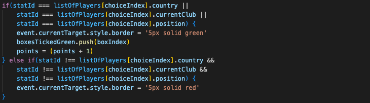
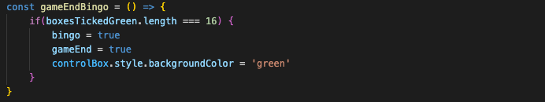
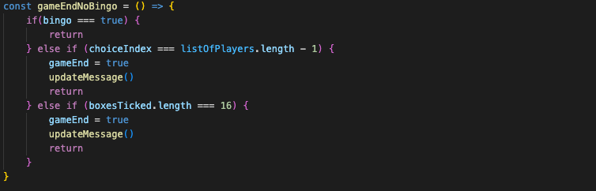
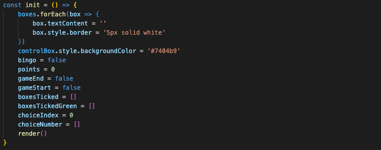

# Football Bingo

## Description

Football Bingo is my first development project after learning the fundamentals of HTML, JavaScript and CSS. It is a browser-based game, requiring players to match a list of footballers to their unique identifier (club, position or nationality) on the Bingo gird. Being a football nerd and having played similar games in the past, I was keen to replicate this functionality and explore the challenges of building it.

## Deployment Link

[Football Bingo](https://jamiekaye9.github.io/football-bingo/)

## Getting Started

1. Clone Git repository: git clone https://github.com/jamiekaye9/football-bingo
2. Open with the ‘Live Server’ extension in VS Code. Alternatively, you can open the index.html file inside the project folder, right click and open with your preferred browser.

No installation or server setup is required for this project.

## Timeframe & Working Team

This was a solo project, built in the timeframe of 1 week.

## Technologies Used

- HTML
- CSS
- JavaScript

## Brief

- Build a browser-based game using HTML, CSS and JavaScript.
-	Include separate HTML, CSS, JavaScript and JavaScript data files organised in an appropriate directory structure.
-	Use CSS Flexbox for page layout design.
-	Include win/loss logic and render win/loss messages in HTML.
-	Instructions about how to play the game must be included with the app.
-	Colours used on the site must have appropriate contrast that meet the WCAG 2.0 level AA standard.
-	All images on the site have ‘alt’ text.

## Planning
### Wireframes

## Build/Code Process

I started this project inside my app.js file, by declaring the game’s key state variables, including tracking whether the game has started or ended, and which boxes have been selected. As someone who likes to simplify concepts through physical examples, I realised this to be my remote control. This helped me to visualise how each variable impacts each other and essentially the player’s journey.

Once the game begins, I attach images to the grid boxes dynamically and randomise the display using the Fischer-Yates shuffle method. It was initially daunting to introduce concepts outside of my course material, but researching and implementing this algorithm removed my fear of straying out of my comfort zone and helped me to accept that concepts that initially seemed too complex were not out of my reach.

The core gameplay logic happens in the handle click function. It checks if the clicked box matches any of the current player’s attributes (country, club or position).
By separating the correct and incorrect states visually (green/red borders), players get immediate feedback on their choices. This was not initially in my plan, but my experience as a Business Analyst came into play, putting myself in the place of the user to understand where I can maximise their satisfaction.

I implemented two types of game-ending logic. One for successfully achieving ‘BINGO’, and one for exhausting all options. The update message function reflects the game’s outcome in a friendly, informative way.

Finally, I included an init function that resets the board, clears all tracking arrays, and restores the UI to its starting state. This is a section I had not considered when previously playing games, however it will now be in the forefront of my mind. It is these realisations which increase my fascination of programming, realising the logic that is in place behind the simple click of a button.

## Challenges

With this being my first programming project, I was introduced to the aspects of errors and unexpected styling. It became apparent there is not one approach to solving errors or fixing styling, and that it is important to find the solution that is most efficient and logical to you.
To narrow down which part of my code was causing an error, I added multiple console logs at different stages of a function, carefully wording each one to get the clarity I needed. Once I found the root cause, I turned to documentation and forums to figure out the best fix. Through repetition and research, this process became smoother over time, and I eventually got better at recognising both the errors and their solutions.
When it came to styling, I found it challenging to get the proportions right and maintain a consistent, user-friendly look for the game. My course instructor suggested adding a red border to the elements, which helped me to clearly see the padding, margins and space between elements. It is a simple but effective tip; one I know I’ll continue to use in future projects and throughout my career.

## Key Learnings/Takeaways

This project was a great opportunity for me to grow my front-end development skills. I deepened by understanding of core JavaScript concepts, improved my DOM manipulation skills, and got more confident in structuring logic-heavy interactive application.

Key Learnings:
- I learned how to dynamically update the DOM with images and styling based on game logic.
- I learned how to use event listeners effectively to control the flow of the game.
- I learned how to clearly define and reset game state variables.
- I was able to practice media queries in my CSS to ensure the UI was clean at different screen widths.

## Future Improvements

To enhance this game further, I could grow the dataset of players and stats to introduce more board variations. This would also allow me to create themed rounds, based on specific countries, leagues or competitions.
Another idea is to introduce multiplayer mode, allowing players to compete head-to-head in real time to achieve bingo first. To do this, I would implement a backend server, creating player rooms/lobbies, where players can join a shared game instance.

