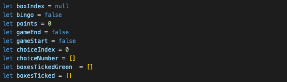

# Football Bingo

## Description
Football Bingo is my first development project after learning the fundamentals of HTML, JavaScript and CSS. It is a browser-based game, requiring players to match a list of footballers to their unique identifier (club, position or nationality) on the Bingo gird. Being a football nerd and having played similar games in the past, I was keen to replicate this functionality and explore the challenges of building it.

## Deployment Link
[Football Bingo](https://jamiekaye9.github.io/football-bingo/)

## Getting Started
1. Clone Git repository: git clone https://github.com/jamiekaye9/football-bingo
2. Open with the ‘Live Server’ extension in VS Code. Alternatively, you can open the index.html file inside the project folder, right click and open with your preferred browser.

No installation or server setup is required for this project.

## Timeframe & Working Team
This was a solo project, built in the timeframe of 1 week.

## Technologies Used
- HTML
- CSS
- JavaScript

## Brief
- Build a browser-based game using HTML, CSS and JavaScript.
-	Include separate HTML, CSS, JavaScript and JavaScript data files organised in an appropriate directory structure.
-	Use CSS Flexbox for page layout design.
-	Include win/loss logic and render win/loss messages in HTML.
-	Instructions about how to play the game must be included with the app.
-	Colours used on the site must have appropriate contrast that meet the WCAG 2.0 level AA standard.
-	All images on the site have ‘alt’ text.

## Planning
### Wireframes

## Build/Code Process
I started this project inside my app.js file, by declaring the game’s key state variables, including tracking whether the game has started or ended, and which boxes have been selected. As someone who likes to simplify concepts through physical examples, I realised this to be my remote control. This helped me to visualise how each variable impacts each other and essentially the player’s journey.

Once the game begins, I attach images to the grid boxes dynamically and randomise the display using the Fischer-Yates shuffle method. It was initially daunting to introduce concepts outside of my course material, but researching and implementing this algorithm removed my fear of straying out of my comfort zone and helped me to accept that concepts that initially seemed too complex were not out of my reach.

Screenshots:

Starting screen

Game started

Win (BINGO)

Loss

Attributions:

https://www.flaticon.com/ - images

Technologies used: HTML, CSS and Javascript.

Next Steps: To further enhance this game I can grow the database of players to make it more unique each time it is played. Additionally, I could add a scoreboard which saves each score as a reminder to the player.

